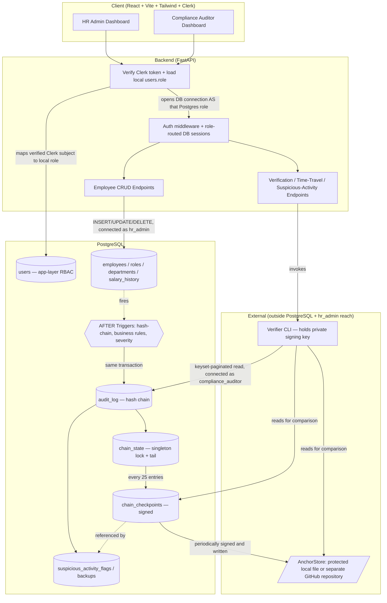
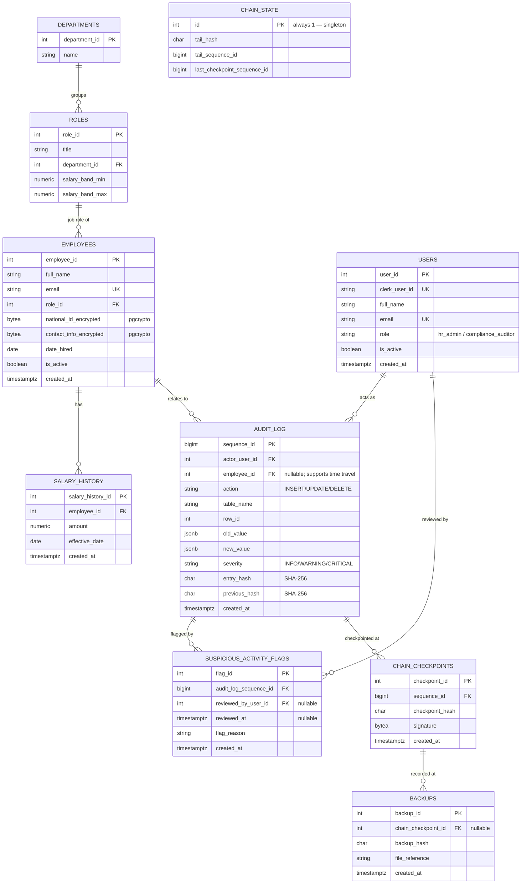
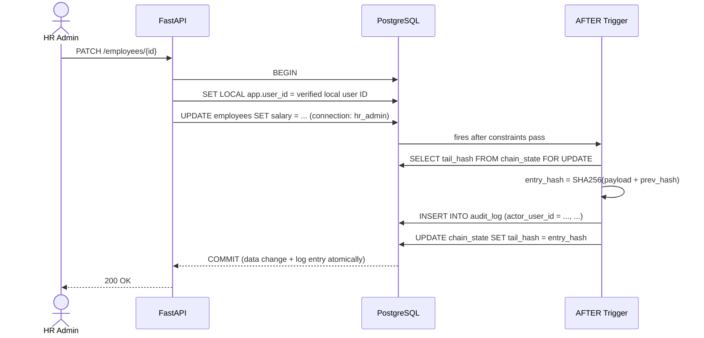
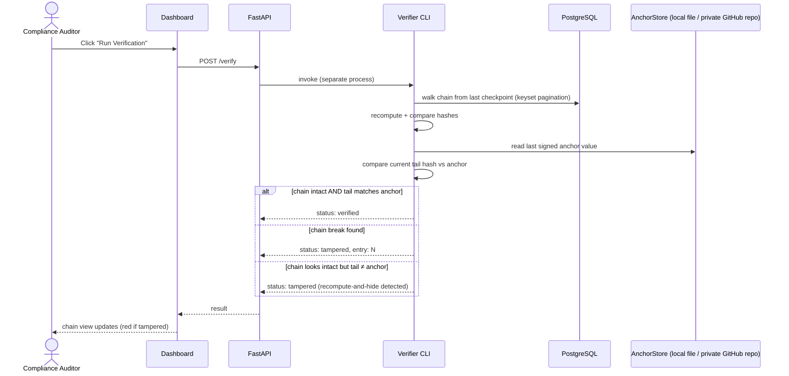

# Argus — System Architecture

**Reference documents:** `PRD_Argus.md` (requirements), `Argus_Team_Development_Plan.md` (task ownership)

---

## 1. Overview

Argus is a PostgreSQL-native, tamper-evident audit logging system, demonstrated on a small Employee Records application. The architecture is built around one central idea: **tampering by a database superuser must be detectable**, provided the verifier's signing key and external anchor store remain outside that attacker's scope. Every other architectural decision in this document exists in service of that guarantee.

Three properties, layered on top of each other, deliver this:
1. **Integrity** — hash-chained log entries (any past edit breaks every hash after it)
2. **Authenticity** — signed checkpoints (a recomputed chain still can't fake a signature it doesn't have the key for)
3. **Least privilege** — strict role separation, so the two Postgres roles in the system (`hr_admin`, `compliance_auditor`) can never do more than their function requires

---

## 2. High-Level Component Architecture



**The `B0 → C0 → B1` path is the two-layer RBAC bridge:** Clerk authenticates the person, FastAPI verifies the Clerk token, and the verified subject is mapped to one local `users` row. Its database-owned `role` value determines which application connection pool (`hr_admin` or `compliance_auditor`) is used downstream. Clerk authentication does not replace the course-required local users table, and a client-provided role never selects database privileges.

**Why the Verifier CLI still sits outside the Backend box:** unchanged from the original design. If verification logic lived inside the same FastAPI process that `hr_admin` actions flow through, a compromise of that process could compromise the thing meant to catch it. Running it as an independent process, with its own credentials and its own private key, is what makes "independently verify" a real claim rather than a marketing one.

---

## 3. Database Schema



**10 tables, 9 relationships, 4+ clearly distinct primary entities** (`users`, `employees`, `audit_log`, `chain_state` at minimum) — comfortably clears the course's minimum of 8 tables / 3 relationships / 4 entities, and every table traces back to this diagram, which the rubric requires explicitly.

**A naming note worth being precise about — three things now share the word "role":**
1. `roles` (the table above) — an **employee job-title lookup** (e.g., "Sales Manager"), referencing `departments`. Pure business data.
2. `users.role` — the **application-level RBAC value** (`hr_admin` / `compliance_auditor`) the course rubric requires as a single column on a single users table.
3. PostgreSQL `CREATE ROLE hr_admin` — a **database connection credential**, enforced by Postgres itself regardless of what the application does.

Same word, three layers. Flagged explicitly here so it's never a source of confusion in the report or viva — and notably, layers 2 and 3 are *meant* to correspond (a `users.role` value determines which Postgres role the connection uses), while layer 1 is unrelated to either.

**`audit_log.actor_user_id` is a real foreign key, not a denormalized text label** — a small but deliberate 3NF-motivated choice: storing both a FK and a redundant free-text actor name would be exactly the kind of redundancy the rubric's normalization requirement is checking for. Because `users` rows are soft-deleted (`is_active = false`, never hard-deleted), this FK stays valid for the append-only log's entire lifetime.

**Indexes:**
- B-tree on `audit_log(sequence_id)` and `audit_log(timestamp)` — keeps the verifier's range scans fast
- Composite B-tree on `audit_log(employee_id, timestamp)` — required for time-travel reconstruction to actually achieve logarithmic lookup rather than a linear scan
- Index every foreign-key column used by joins or dashboard filters (`roles.department_id`, `employees.role_id`, `salary_history.employee_id`, `audit_log.actor_user_id`, `audit_log.employee_id`, `suspicious_activity_flags.audit_log_sequence_id`, and `backups.chain_checkpoint_id`)
- `chain_state` is a single-row table by design — concurrency safety depends on every writer contending for that one row via `SELECT ... FOR UPDATE`

### 3.1 Relational Schema and Data Dictionary

The migration set is the source of truth, but the following compact schema is included for course evaluation: `users(user_id PK, clerk_user_id UQ, email UQ, role CHECK, is_active)`, `departments(department_id PK, name UQ)`, `roles(role_id PK, department_id FK, title, salary_band_min, salary_band_max)`, `employees(employee_id PK, role_id FK, email UQ, national_id_encrypted, contact_info_encrypted, is_active)`, `salary_history(salary_history_id PK, employee_id FK, amount CHECK(amount > 0), effective_date, UNIQUE(employee_id, effective_date))`, `audit_log(sequence_id PK, actor_user_id FK, employee_id FK NULL, action, table_name, row_id, old_value, new_value, severity, entry_hash, previous_hash, created_at)`, `suspicious_activity_flags(flag_id PK, audit_log_sequence_id FK, reviewed_by_user_id FK NULL, reviewed_at, flag_reason)`, `chain_state(id PK CHECK(id = 1), tail_hash, tail_sequence_id, last_checkpoint_sequence_id)`, `chain_checkpoints(checkpoint_id PK, sequence_id FK, checkpoint_hash, signature, created_at)`, and `backups(backup_id PK, chain_checkpoint_id FK NULL, backup_hash, file_reference, created_at)`.

**Constraint policy:** email and Clerk IDs are unique; `users.role` and audit severity use CHECK constraints; salary amounts are positive; `salary_band_min <= salary_band_max`; all mandatory business columns are NOT NULL; defaults provide timestamps and active status. `old_value` and `new_value` are JSONB but contain masked sensitive values only.

### 3.2 Data Dictionary

| Table | Purpose | Primary key | Important foreign keys / constraints |
|---|---|---|---|
| `users` | Local authorization and audit attribution for Clerk-authenticated people | `user_id` | `clerk_user_id` and email unique; `role` restricted to the two application roles |
| `departments` | Normalized department lookup | `department_id` | Department name unique |
| `roles` | Employee job-title and salary-band lookup | `role_id` | `department_id → departments`; valid salary band |
| `employees` | Current employee record | `employee_id` | `role_id → roles`; email unique; encrypted PII fields |
| `salary_history` | Effective-dated salary changes | `salary_history_id` | `employee_id → employees`; positive amount; one row per employee/date |
| `audit_log` | Append-only tamper-evident change records | `sequence_id` | Actor and optional employee FKs; masked JSONB before/after values |
| `suspicious_activity_flags` | Persisted review queue for SQL-detected patterns | `flag_id` | Audit entry FK; optional reviewer FK |
| `chain_state` | Singleton lock and current chain tail | `id` | `CHECK(id = 1)` |
| `chain_checkpoints` | Signed verifier checkpoints | `checkpoint_id` | `sequence_id → audit_log` |
| `backups` | Hashes and references for native PostgreSQL backups | `backup_id` | Optional checkpoint FK |

---

## 4. Key Data Flows

### 4.1 Login — Bridging the Two RBAC Layers

```mermaid
sequenceDiagram
    actor U as User
    participant API as FastAPI
    participant DB as PostgreSQL (as app service account)

    U->>API: Clerk session token
    API->>API: verify Clerk signature and extract subject
    API->>DB: SELECT user_id, role FROM users WHERE clerk_user_id = subject
    DB-->>API: role = 'hr_admin' (or 'compliance_auditor')
    Note over API,DB: On every request, verified local role selects the<br/>Postgres connection pool; the frontend never selects it
    API-->>U: authorized application response
```

Clerk supplies authentication, but the `users` table with its database-owned `role` column remains the single-table RBAC pattern required by the course. The same local role value selects a real Postgres connection pool; it is not taken from a mutable client claim. Clerk webhook synchronization is optional for profile updates; the two initial course-demo users are seeded after their Clerk accounts are created.

### 4.2 Normal Write → Audit Entry (same transaction, always)



If the transaction rolls back for any reason, neither the data change nor the audit entry persists. PostgreSQL triggers cannot independently persist a rejected-attempt row after raising an exception; optional failed-authorization telemetry is written separately by the API and is not represented as an atomic success audit entry.

### 4.3 Verification, Including the Recompute-and-Hide Case



The third branch is the entire reason the anchor exists. A superuser who edits a historical row **and** recomputes every subsequent hash produces a chain that is internally perfectly consistent — the first two checks alone would report "clean." Comparing the tail against a previously signed, externally-anchored value is what actually catches it.

---

## 5. Security Architecture Summary

| Layer | Mechanism | Defends Against |
|---|---|---|
| Application-level RBAC | Single local `users` table, database-owned `role` column, checked after Clerk token verification and on every menu/page/API route | The course's single-most-checked mistake: separate tables per role |
| Authentication | Clerk prebuilt login/logout, OAuth, session management, and signed token verification | Credential theft, password-storage mistakes, forged sessions |
| Database roles | `GRANT`/`REVOKE` — `hr_admin` has no `UPDATE`/`DELETE` on `audit_log`; `compliance_auditor` has no write access anywhere | Privilege misuse, log tampering by the app's own admin role |
| Database triggers | Business-rule enforcement (Section 5.7), severity tagging | Policy violations bypassing app-layer checks |
| Hash chain | SHA-256, each entry chained to the previous | Silent single-entry tampering |
| Checkpoint signing | Asymmetric signature over periodic checkpoints, key never exposed to the app or `hr_admin` | Forged/planted anchor entries |
| External anchor | Tail hash compared against a location outside `hr_admin`'s reach | Recompute-and-hide (edit + rehash everything after) |
| Encryption at rest | `pgcrypto` on sensitive columns plus redacted audit JSONB payloads | Data exposure even with read access |

---

## 6. Technology Stack

| Concern | Choice | Why |
|---|---|---|
| Backend framework | FastAPI | Async-native (needed for the concurrency-lab demo and parallel verification), thin enough that the database layer stays the actual point |
| ORM / DB access | SQLAlchemy 2 (async) + Alembic | Parameterized by default; raw SQL remains limited to triggers, functions/procedures, locks, and verifier scans |
| Database | PostgreSQL | Only engine here with `pgcrypto`, native `JSONB`, and the constraint/trigger richness the whole design depends on |
| Verification tool | Standalone Python CLI | Independent of the web app's process and credentials, by design (Section 2) |
| Frontend | React + Vite + Tailwind, Clerk React, React Hook Form, Zod, TanStack Query | Established free UI, authentication, validation, and data-fetching primitives without custom reinvention |
| Authentication | Clerk Hobby | Managed identity and OAuth; Argus retains authorization in PostgreSQL `users.role` |
| Signing | Python `cryptography` (Ed25519) | Established audited primitives; no custom cryptographic implementation |
| Testing / CI | pytest, pytest-benchmark, Playwright, GitHub Actions | Free automated validation and CI/CD bonus without changing the security boundary |
| Migrations | Alembic | Schema changes tracked and reviewable, same as the audit log's own philosophy |

### 6.1 ORM vs. Raw SQL — Where the Boundary Actually Is

The course rubric requires ORM usage for database interaction, with raw SQL permitted specifically for "advanced database features (e.g., stored procedures, triggers, or performance-critical queries)." Argus's design already splits along exactly this line, which is worth stating explicitly rather than leaving implicit:

- **Through SQLAlchemy (the ORM):** all employee CRUD, local user/RBAC lookups, salary-history reads, and standard dashboard queries
- **As raw SQL / PL/pgSQL (the rubric's named exception):** the hash-chaining trigger, business-rule enforcement triggers, `chain_state` locking, the verifier's keyset-paginated chain walk, `reconstruct_employee_state(...)` function, and `CALL refresh_suspicious_activity_flags()` procedure

Every raw-SQL component falls squarely inside the rubric's own carve-out — none of it is raw SQL used in place of the ORM for convenience.

---

### 6.2 Views, Function, and Stored Procedure (Course-Required, Purpose-Built)

Both exist to back real dashboard functionality — neither is a throwaway artifact added only to satisfy the rubric line item:

- **`v_employee_directory`** (view) — joins `employees` + `roles` + `departments` + each employee's latest `salary_history` row; backs the HR Admin Dashboard's employee list directly
- **`v_compliance_overview`** (view) — joins `chain_state` + the latest `chain_checkpoints` row + the latest `backups` result + a count of unreviewed `suspicious_activity_flags`; backs the Compliance Auditor Dashboard's status cards in one query instead of four
- **`reconstruct_employee_state(employee_id, as_of_timestamp)`** (function returning JSONB) — implements time-travel reconstruction for the dashboard
- **`CALL refresh_suspicious_activity_flags()`** (stored procedure) — persists the aggregate/window-function scan; this explicitly satisfies the course stored-procedure requirement distinct from trigger functions

---

### 6.3 Deployment

- **Containerization:** Docker Compose locally (`postgres`, `api`, `frontend` services); images pushed to Docker Hub
- **Cloud target:** Neon Free hosts PostgreSQL; Render Free hosts FastAPI; Render Static Site or Vercel Hobby hosts React. Render Free Postgres is deliberately not used because it expires after 30 days and has no backups
- **External anchor:** `AnchorStore` writes to a protected local file during development and a separate private GitHub repository for the deployed demo. The database-superuser threat model excludes compromise of GitHub, its token, or the signing key
- **Secrets:** `.env` / deployment secrets, excluded via `.gitignore` — Neon URLs, Clerk keys, GitHub anchor token, and signing key paths are never hardcoded or committed
- **Backup/recovery:** native `pg_dump` / `pg_restore`, hashed and verified per Section 5.11 — this already exceeds what the rubric asks for (verified integrity, not just a backup existing)

---

## 7. Repository Structure

Mirrors the two-developer ownership split directly, so file-level ownership and task ownership are the same thing:

```
/db/            → schema, migrations, PL/pgSQL triggers, verifier CLI, benchmark scripts   (Abhinav)
/api/           → FastAPI app, auth, endpoints                                             (Nidhurshek)
/frontend/      → React dashboards                                                         (Nidhurshek)
/contracts/     → schema reference, OpenAPI spec, agreed JSON shapes — frozen after Week 1 (shared)
```

---

## 8. Key Architectural Decisions

| Decision | Alternative Considered | Why Rejected |
|---|---|---|
| Linear hash chain + signed checkpoints | Merkle tree | Real O(log n) verification benefit, but a structural rewrite this late carries more risk than this project's threat model (no need for per-record inclusion proofs) justifies |
| `SELECT ... FOR UPDATE` row-level lock on a singleton row | Postgres advisory locks | Maps directly onto the 2PL locking taught in the syllabus and is easier to justify in a viva; advisory locks aren't a named course concept |
| Signed external anchor | Anchor hash alone, unsigned | A hash alone can be planted by anyone with write access to the anchor location; a signature additionally proves authorship |
| PostgreSQL only, `JSONB` for semi-structured fields | A second NoSQL database alongside Postgres | Adds real infrastructure complexity without adding real capability the project needs; `JSONB` demonstrates the same conceptual tradeoff |
| Standalone verifier process | Verification logic inside the FastAPI app | A verifier sharing fate with the thing it watches undermines the entire "independent verification" claim |
| Single `users` table with a `role` column | Separate tables per role (e.g., `hr_admin_users`, `auditor_users`) | The course rubric explicitly requires this pattern and explicitly warns against the alternative; it also composes cleanly with the Postgres-role layer underneath it rather than duplicating it |

---

## 9. Explicit Non-Goals

Full detail in `PRD_Argus.md` Section 14 — restated briefly here since architecture documents should be honest about their edges: no high availability/clustering, no multi-tenant isolation, no public-blockchain anchoring, no full automated tamper-recovery pipeline, no natural-language audit search. Each was a deliberate scope decision, not an oversight.
