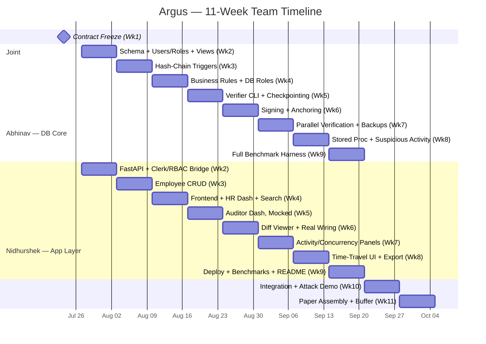

# Argus — Two-Developer Team Development Plan

**Duration:** 2.5 months (11 weeks) | **Team:** Abhinav, Nidhurshek | **Reference:** PRD_Argus.md

---

## 1. Architectural Philosophy: Contract-First Parallel Development

Two people building one tightly-coupled system (shared schema, shared API, shared crypto format) cannot achieve zero coordination — pretending otherwise just moves the conflicts to the worst possible time (Week 9). The correct architectural move is to **freeze the interfaces between the two halves once, early, and build against that frozen contract independently afterward.**

This plan has exactly **one mandatory joint week (Week 1)**, **three explicitly identified minor coordination points** during the parallel phase (stated below, not hidden), and **two joint weeks at the end (10-11)** for integration, demo, and paper assembly. Everything else — roughly 8 of 11 weeks — is fully independent, branch-isolated work.

---

## 2. The Split: Why This Is 50/50 Despite Looking Asymmetric

**Abhinav — Database Core, Security & Verification Engine**
Owns everything below the API: schema stewardship, hash-chaining triggers, concurrency-safe locking, business-rule enforcement, the standalone verification CLI, checkpoint signing, external anchoring, and — critically — Section 5.13's parallel-verification engine, the project's single research-novelty lever. Fewer discrete pieces, but each one carries real conceptual risk: get the locking or the cryptography wrong and the entire security claim collapses.

**Nidhurshek — Application Layer, Dashboards & Integration**
Owns everything above the schema: FastAPI (auth, CRUD, role-routed sessions), both full dashboards (Section 5.6 — this is genuinely the larger UI surface: chain view, diff viewer, activity panel, query/indexing panel, security posture panel, concurrency lab), evidence export, and all integration/mock-swapping work. More discrete pieces and far more surface area, but each follows a known engineering pattern rather than requiring novel correctness arguments.

**The justification:** this is a depth-vs-breadth balance, not a line-count balance. Abhinav carries the harder-per-line, higher-stakes work with a smaller footprint; Nidhurshek carries a larger footprint of well-understood engineering plus all the integration glue that makes the system demoable. Both tracks also carry a genuine share of the Section 16 research/evaluation writing (below) — neither person is "just the coder" and the other "just the writer."

---

## 3. Week 1 — Joint Foundation & Contract Freeze (Mandatory Sync)

Both developers, together, before branching:

- Finalize the ER diagram, relational schema, data dictionary, and exact constraints for all ten tables: `users`, `departments`, `roles`, `employees`, `salary_history`, `audit_log`, `suspicious_activity_flags`, `chain_state`, `chain_checkpoints`, and `backups`. This does not change unilaterally after this week.
- Freeze the **API contract**: every endpoint Nidhurshek will build, with exact request/response JSON shapes — most importantly the verification-status response (`{status, entry, anchor_match}`-style shape), since Nidhurshek will mock this immediately while Abhinav builds the real thing behind it.
- Agree the **exact hash-input serialization** (field order, encoding) for Algorithm 1 (PRD Section 16.4) — this is a byte-level agreement that both Abhinav's PL/pgSQL trigger and Abhinav's own CLI depend on internally; Nidhurshek never needs to know it, only the output contract.
- Agree the **exact business-rule list** (Section 5.7's 2-3 rules), masked audit-payload policy, and API error shape. Failed-attempt telemetry is explicitly non-atomic and optional.
- Agree Clerk subject-to-local-user mapping, role names/credentials (`hr_admin`, `compliance_auditor`), and how verified local roles select database pools.
- Set up the private shared repository, collaborators, `.gitignore`, branch strategy (Section 6 below), Docker Hub namespace, and an empty Alembic baseline migration.

**Exit criterion for Week 1:** both developers can state, without checking with each other, exactly what JSON any endpoint returns and exactly what every table column is called. If either can't, do not branch yet.

---

## 4. Weeks 2-9 — Parallel Independent Tracks

### Abhinav — Database Core, Security & Verification Engine

| Week | Work |
|---|---|
| 2 | Implement full schema via Alembic — including the new `users`, `departments`, and `roles` tables (Section 4/5.1) required by the course RBAC rubric; scaffold `chain_state` + `FOR UPDATE` locking (Section 5.4); create the two required views, `v_employee_directory` and `v_compliance_overview` (Section 5.14), alongside the schema they join |
| 3 | Implement hash-chaining `AFTER` triggers (Section 5.2) fully, including severity assignment; validate Attack Demo scenario #2 (superuser edits a historical row) directly against the DB via `psql` |
| 4 | Implement business-rule triggers, masked audit payloads, and `hr_admin`/`compliance_auditor` roles with full `GRANT`/`REVOKE`; document optional API-side failed-attempt telemetry separately |
| 5 | Build the verification CLI (Section 5.3) with keyset pagination; implement checkpointing (Section 9) with a **configurable** interval (needed later for the paper's interval sweep, Section 16.8) |
| 6 | Implement checkpoint signing with `cryptography`/Ed25519; implement the `AnchorStore` interface (protected local file plus private-GitHub-repository adapter); validate Attack Demo #5 and #6 directly via the CLI |
| 7 | Implement parallel checkpoint verification (Section 5.13); implement backup integrity verification (Section 5.11), storing results in the new `backups` table |
| 8 | Write `reconstruct_employee_state(employee_id, as_of_timestamp)` as a returning function and `CALL refresh_suspicious_activity_flags()` as the real course-required stored procedure. Persist flagged results and hand both signatures to Nidhurshek for API wrapping. Run the fast pilot benchmark now (a few thousand synthetic rows, sequential vs. 2-4 workers) |
| 9 | Build the full DB-side benchmark harness (Section 16.8: insert/update/delete/verification latency, checkpoint-interval sweep, full parallel-vs-sequential test at 100/1K/10K/100K rows); begin writing Sections 16.2, 16.4, 16.5, 16.6 |

### Nidhurshek — Application Layer, Dashboards & Integration

| Week | Work |
|---|---|
| 2 | FastAPI skeleton; Clerk React/FastAPI integration using verified session tokens; local `users.clerk_user_id` mapping and role-routed DB sessions. The database-owned `users.role`, never a client claim, selects the Postgres role pool (`hr_admin`/`compliance_auditor`) |
| 3 | Employee CRUD endpoints. Note: audit side-effects will silently start appearing once Abhinav's Week 3 triggers land — no code change needed on Nidhurshek's side for this to work |
| 4 | React/Vite frontend skeleton (Tailwind, Clerk components, React Hook Form, Zod, TanStack Query); HR Admin Dashboard with CRUD forms, validation, search by name/email, and pagination |
| 5 | Start the Compliance Auditor Dashboard **against the Week 1 mocked contract** — status banner, chain-view visualization, anchor status — using fake JSON so this never waits on Abhinav's real verifier |
| 6 | Diff viewer, filterable audit log table with **search (actor/table name) + pagination** (course requirement, distinct from the verifier's internal keyset pagination), "Run Verification" control — begin swapping mocked calls for real ones as Abhinav's Week 5-6 pieces land (pull-based, not blocking) |
| 7 | Activity & risk panel (now backed by the real `suspicious_activity_flags` table once Abhinav's Week 8 work lands), query/indexing panel, security posture panel, concurrency lab control (fires two simultaneous update requests and displays resulting order — this is the live test of Abhinav's Week 4 locking work) |
| 8 | Time-travel UI + thin API wrapper around Abhinav's Week 8 function/procedure; suspicious-activity panel + wrapper. Start signed JSON evidence export only once Abhinav confirms the Week 6 signing utility is ready |
| 9 | Finish evidence export; deploy React and FastAPI, configure Neon and Clerk secrets, add pytest/Playwright checks and a GitHub Actions workflow, build the API/frontend-side benchmark harness, and write the root `README.md` with installation, execution, Docker Hub, backup/restore, and live-URL evidence |

---

## 5. Weeks 10-11 — Joint Integration, Attack Demo, Paper Assembly, Buffer

| Week | Work |
|---|---|
| 10 | Full end-to-end integration: swap every remaining mock for a real call. Rehearse all six attack-demo scenarios (PRD Section 6) together through the actual UI, not just individually via CLI/`psql`. Run the complete benchmark suite together if not already finished; assemble growth-curve graphs |
| 11 | Joint paper assembly — reconcile all of Section 16 into one document (16.1 and 16.10 are written jointly here, as synthesis). Finalize the report per Section 15's structure. Full dry-run of the live demo. **Keep this week's back half as genuine buffer** — do not fill it with new feature work; last-minute integration issues are the most common failure point right before a demo |

---

## 6. Git & Ownership Strategy (Minimizing File-Level Conflicts, Not Just Task Conflicts)

**Branch structure (satisfies the course's explicit `main` + `dev` requirement, while keeping personal isolation intact):**
- `main` — protected, production-stable; updated only from `dev` at integration checkpoints, never directly
- `dev` — the shared integration branch the course rubric explicitly asks for; this is where both personal branches merge via PR before anything reaches `main`
- `feature/abhinav-core` and `feature/nidhurshek-app` — long-lived personal branches, each merging into `dev` (never directly into `main`) at the end of every week. Git cannot use `dev/...` feature branches while a required branch named `dev` already exists
- The repository is private; both students are GitHub collaborators. Keep at least 10 meaningful commits, use descriptive imperative messages, and merge weekly work to `dev` through pull requests
- `.gitignore` is committed before any source or secrets. `.env`, keys, database dumps containing data, node modules, virtual environments, and generated reports are never committed
- Directory ownership mirrors the task split exactly, so file-level merge conflicts are structurally rare:
  - `/db/` (migrations, PL/pgSQL, verifier CLI, benchmark scripts) → **Abhinav**
  - `/api/`, `/frontend/` → **Nidhurshek**
  - `/contracts/` (schema reference, OpenAPI spec, agreed JSON shapes from Week 1) → **shared, frozen after Week 1**, touched only by mutual agreement
- A short async daily note (what I finished, what I'm touching next) in a shared doc or channel — not a meeting, just enough visibility to catch surprises early
- One real recurring sync: a 30-minute weekly call, specifically to catch integration drift before Week 10 rather than during it

**Evidence checklist before submission:** private GitHub repository link, collaborator history, `main` and `dev` branches, 10+ meaningful commits, Docker Hub image link, `pg_dump`/`pg_restore` demonstration, deployed frontend/API URL, and screenshots or test output for each rubric item.

---

## 7. Research Track (Section 16) Ownership

| Section | Owner | Why |
|---|---|---|
| 16.1 Contribution Statement | **Joint** | Final synthesis, written together once both tracks' results exist |
| 16.2 Threat Model | **Abhinav** | Directly describes what Abhinav built (adversary model, attack table) |
| 16.3 Security Analysis (CIA) | **Abhinav** | Confidentiality/integrity/availability all center on the schema/crypto/verifier layer |
| 16.4 Formal Algorithm | **Abhinav** | Algorithm 1 is Abhinav's trigger logic, formalized |
| 16.5 Complexity Analysis | **Abhinav** | Requires deep familiarity with the locking and chain-walk internals |
| 16.6 Failure Analysis | **Abhinav** | Power failure, rollback, verifier crash all concern Abhinav's components |
| 16.7 Comparison Matrix | **Joint (Abhinav leads)** | Abhinav verifies technical cells; Nidhurshek contributes the product-positioning framing |
| 16.8 Evaluation Plan & Results | **Joint (split by layer)** | Abhinav: DB-side benchmarks (the critical parallel-vs-sequential result). Nidhurshek: API/frontend-side benchmarks |
| 16.9 Paper vs. Project Content | **Nidhurshek** | Directly concerns the dashboard Nidhurshek owns |
| 16.10 Sequencing Note | **Joint** | Final synthesis |

---

## 8. The Three Honest Coordination Points (Restated Plainly)

A principal architect's job is to minimize coordination, not to claim it doesn't exist. Exactly three points require the two tracks to touch:

1. **Week 1** — the contract freeze (unavoidable, one-time, upfront)
2. **Ongoing, Weeks 5-7** — Nidhurshek swaps mocked verification responses for real ones as Abhinav's pieces land (pull-based on Nidhurshek's schedule, never a hard block)
3. **Week 8** — Evidence export (Nidhurshek) needs checkpoint signing (Abhinav, finished Week 6) to exist first — flagged two weeks in advance, not discovered as a surprise

Everything else across the 11 weeks is genuinely, structurally independent.

---

## 9. Project Timeline — Gantt Chart

The course rubric asks for a simple Gantt chart under Project Planning. Dates below assume a Monday start of **July 20, 2026** — shift every date equally if the actual start differs.

