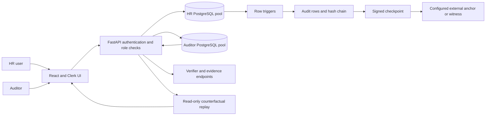

# Argus: Conference Positioning and Professor Walkthrough

This document is the presentation source of truth for the current code. It deliberately separates what the repository implements from what remains a research or deployment claim.

## One-sentence project description

Argus is a PostgreSQL audit system that records row mutations in a hash-linked log, supports independent integrity checks and portable evidence proofs, and lets an auditor replay an employee’s history while excluding selected events to compare the resulting state and estimate time-weighted salary-rate exposure.

## Defensible conference claim

> **Argus demonstrates an audit-to-impact workflow for payroll investigations: an auditor selects specific row-level events from an employee’s history, computes a read-only alternative replay that omits those events, and compares effective-dated salary states with a time-weighted salary-rate exposure estimate. The replay is attached to a PostgreSQL audit and evidence-verification workflow.**

This is an **applied system contribution**, not a claim that Argus invented hash chains, Merkle proofs, database audit logs, temporal reconstruction, or counterfactual replay. Prior work already studies transaction reenactment and what-if changes to historical transaction histories: [Niu et al., VLDB 2017](https://www.vldb.org/pvldb/vol10/p1857-niu.pdf) and [Efficient Answering of Historical What-if Queries](https://arxiv.org/abs/2203.12860). Existing PostgreSQL audit systems such as [pgMemento](https://github.com/pgMemento/pgMemento) record and restore row histories; [SQL Server Ledger](https://learn.microsoft.com/en-us/sql/relational-databases/security/ledger/ledger-overview) provides cryptographic tamper evidence and external digests. [RFC 9162](https://www.rfc-editor.org/rfc/rfc9162.html) standardizes Merkle transparency-log mechanisms.

The difference we can responsibly present is the **combination and evaluation of employee-scoped event exclusion, effective-dated salary replay, and a cumulative salary-rate exposure measure inside an auditor-facing tamper-evidence workflow**. Do not call it the first counterfactual replay system or claim a new cryptographic primitive. A full novelty claim still requires a broader literature search before submission.

## What Argus does

The core user-facing paths are `/hr/dashboard`, `/hr/employees`, `/hr/settings`, `/auditor/overview`, `/auditor/activity`, `/auditor/log`, `/auditor/chain`, `/auditor/time-travel`, `/auditor/counterfactual`, and `/auditor/forensic-evidence`. The routes are defined in `frontend/src/App.tsx`.

The code to point at during questions:

- Database schema and role grants: `db/alembic/versions/`, `db/scripts/setup_roles.sql`.
- Mutation capture and hash linking: `db/triggers/audit_employees.sql`, `db/triggers/audit_salary_history.sql`.
- API auth, authorization, and transaction actor context: `api/middleware/clerk.py`, `api/dependencies.py`, `api/routers/`.
- HR on-demand signed checkpoints: `api/routers/checkpoints.py`, `db/alembic/versions/023_hr_checkpoint_creation.py`, and `frontend/src/pages/hr/HRSettings.tsx`.
- Signed checkpoint and chain verifier: `db/cli/verifier.py`, `db/cli/signer.py`, `db/cli/anchor_store.py`.
- Selective evidence: `db/cli/merkle_tree.py`, `db/cli/capsule.py`, `db/cli/verify_capsule.py`.
- Counterfactual replay: `db/cli/counterfactual.py`, `api/routers/audits.py`, `frontend/src/pages/auditor/CounterfactualPage.tsx`.
- Browser regression coverage: `frontend/e2e/`.

## 10-minute professor walkthrough

### Before the meeting

1. Use the isolated **`argus-demo` local database** described in [Local Professor Demo Setup](LOCAL_DEMO_SETUP.md). The default `python -m db.seed_demo` resets demo employee, salary-history, audit, checkpoint, and suspicious-flag rows. For an additive expansion, run `python -m db.seed_demo --skip-purge --scale 40` only inside the local demo seed container; each run appends another 40 employees and audit activity. Never point either command at a shared or production database.
2. Apply migrations and configure the least-privilege database roles using the repository’s setup guide. Configure Clerk and the server-side allowlists for one HR account and one auditor account. There is no role-toggle control in the UI; use separate authorized accounts/sessions.
3. Confirm the local demo signing key and anchor are available before presenting integrity verification. In this setup, checkpoints are Ed25519-signed and the local file anchor can be checked, but the file is not an independent trust domain. The current demo has no persisted witness note, so the Witness Quorum panel reports **Unverified**. Do not describe the laptop setup as an active independently witnessed 2-of-3 deployment.
4. Start PostgreSQL, the API, and Vite using the current setup instructions in `README.md`. Check `/api/health`, sign in, and rehearse with the same database you will present.
5. In the Auditor Overview, run verification. Proceed with integrity claims only if each relevant check reports **Verified**. If the configured anchor is unavailable or a checkpoint is unsigned, say so explicitly.
6. Do not enter real national identifiers, addresses, or emergency contact details in a demo database. Confirm the PII encryption migration and runtime key are configured before showing any encryption status.

Useful curated personas in the demo database:

| Persona | Demo use |
|---|---|
| Marcus Vance (#1) | Three career/salary eras for historical reconstruction. |
| Elena Rostova (#2) | Seeded off-hours salary event for risk review. |
| Tariq Al-Mansoor (#3) | Deactivated personnel example for access-revocation discussion. |

The appended scale employees provide enough rows to demonstrate directory
search, filtering, pagination, and audit-chain browsing. The scale records use
synthetic data and a system-maintenance actor; do not present that actor as a
human HR action.

### Talk track and actions

**0:00–1:00 — Problem and scope**

“A normal audit log tells us what was recorded. Argus asks whether we can verify that history and then investigate an alternative history without editing the original records. This prototype focuses on employee and compensation changes in PostgreSQL.”

**1:00–2:30 — Architecture**

Show the flow diagram above. Explain that the trigger records a mutation in the same database transaction as the business update; the API routes HR and auditor roles to separate database connections; a separate verifier checks chain/checkpoint evidence. Say **tamper-evident**, not “immutable”: a privileged database operator can still rewrite unanchored data, and detection depends on trustworthy external checkpoints and independent key custody.

**2:30–4:00 — HR mutation**

Sign in with the HR account. Open `/hr/employees`, select a demo employee, and add a salary-history entry with an effective date. Point out that the HR action changes the business row; the database trigger is responsible for producing its audit event. Avoid entering real PII.

Optionally open `/hr/settings` and create a signed checkpoint. The action seals all audit events since the previous checkpoint and records the requesting HR administrator. It does not create an external anchor; explain signing and anchoring as separate steps. Migration `023_hr_checkpoint_creation` must be applied, and production mode currently disables this local-signer action until a managed signer is configured.

**4:00–5:30 — Verify the event**

Sign in with the auditor account. Run verification from `/auditor/overview`. Open `/auditor/log` and locate the just-created salary event. Then use `/auditor/chain` to show its sequence and hash linkage. Distinguish the local chain check from external-anchor verification; show which status actually passed.

**5:30–7:30 — Main contribution: counterfactual replay**

From that employee’s audit rows, copy a real sequence ID. Open `/auditor/counterfactual`, select the same employee, enter the ID, leave “As-Of” empty for the latest recorded point, and run replay. Explain that the engine applies the recorded employee and salary-history mutations to two in-memory tracks: actual and event-excluded. It honors salary row IDs and effective dates, so a deletion, correction, or delayed effective date changes the alternative state appropriately. The database is not updated.

Use this exact caveat: “The cumulative result is an estimate of the annual salary-rate gap integrated over calendar-day intervals. It is not proof that payroll paid that amount, proof that an event was fraudulent, or a causal estimate of legal damages.”

**7:30–8:30 — Portable evidence**

Open `/auditor/forensic-evidence`. Generate a Merkle inclusion proof or capsule for a selected sequence. For offline verification, provide the verifier with the public key through a separately trusted channel; the capsule’s bundled public key alone is not a trust anchor. The current CLI requires `--trusted-public-key PEM_PATH`.

**8:30–10:00 — Limits and research direction**

Summarize the contribution as a working applied pipeline, not a novel cryptographic algorithm. Name current limits: replay uses the logged row mutations available for the selected employee; exposure uses salary rates/effective dates rather than payroll disbursement records; integrity beyond the database depends on external anchoring; and evaluation must use a documented synthetic workload plus an independently computed oracle before performance or novelty claims are made.

## Main novelty slide text

**Title:** From tamper-evident employee events to counterfactual compensation exposure

**Problem:** Standard row-history views reconstruct what happened but do not directly show the alternative employee state after excluding a selected set of mutations and accounting for effective-dated salary changes.

**Method:** Select event IDs → replay the employee’s state twice (all events / selected events excluded) → apply salary-history INSERT, UPDATE, and DELETE by row identity and effective date → integrate positive annual salary-rate differences over the replay horizon.

**Output:** Side-by-side state, the exact excluded event IDs, annualized salary-rate difference at the selected horizon, and a time-weighted exposure estimate. Source records remain unchanged.

**Claim boundary:** Novelty is in the applied, event-scoped audit-to-impact workflow and its evaluation. General what-if replay and Merkle audit evidence predate Argus.

## Minimum evaluation package for a conference submission

The repository is not publication-ready merely because the UI and unit tests work. Before submission, produce a repeatable experiment with:

1. **A correctness oracle:** deterministic histories covering salary insertion, correction, deletion, retroactive/future effective dates, multiple excluded events, event IDs from another employee, and an `as_of` cutoff. Compute expected states and exposure independently from the replay implementation.
2. **A controlled dataset:** generated fake identities and compensation values only; publish the generator, fixed random seed, schema, event-count distributions, and replay horizons.
3. **Baselines:** compare state reconstruction against the simple non-exclusion replay and compare the exposure calculation against an independently implemented day-by-day oracle. Treat pgMemento, pgAudit, and SQL Server Ledger as capability context unless you can run equivalent workloads on them; they are not automatically fair performance baselines.
4. **Measurements:** report warm-up, hardware/software versions, repetitions, median and tail latency, throughput, memory, and history-size sensitivity. Separate database fetch time from replay compute time. Report failures and unsupported event forms.
5. **Security tests:** demonstrate that altered rows, invalid checkpoints, untrusted bundled keys, unauthorized directory reads, and missing cryptographic configuration fail visibly and safely.
6. **Reproducibility:** one clean command or script to generate data, run the oracle, run replay, and write machine-readable results. Preserve raw outputs and plots with the paper artifact.

Do not publish fixed benchmark numbers from old documentation unless the exact harness, source revision, machine, and raw results reproduce them.

## Current known caveats

- Counterfactual replay is an **exclusion simulation**. It does not determine intent, prove misconduct, or model every downstream business process.
- The cumulative impact is a salary-rate exposure estimate, not the actual amount paid or a payroll ledger reconciliation.
- Hash chaining detects changes only when checked against a trusted starting point; a current chain recomputed by the same compromised administrator is not independent proof.
- A public key embedded in an evidence bundle is not trusted automatically. The verifier must receive an independently trusted key.
- Runtime employee and salary writes now require a short-lived HMAC-signed actor context verified by a restricted PostgreSQL function. The ordinary runtime database roles cannot read the verifier key or edit verifier objects; manually setting the legacy actor GUCs is insufficient. This protects against a database-only runtime credential holder under the stated role/ownership assumptions. It does not protect against a compromised API process, database owner, superuser, or key custodian. Those boundaries and the adversarial PostgreSQL checks must be included in any security claim.
- This is an academic prototype. Production deployment requires a tested key-management, rotation, backup, retention, and incident-response plan.
- **Verified local demo snapshot (2026-10-07):** 100 employees, 104 salary-history rows, 206 audit events, and 8 signed checkpoints. The latest checkpoint covers sequence 200; the audit tail is sequence 206. The live Auditor Overview verified the hash chain, local anchor record, and checkpoint signatures through sequence 206 with zero anomalies. Treat these as snapshot values; mutations and additional seed runs change them.
- The local demo's witness report is **Unverified** because no persisted witness note is configured. A passing hash-chain, local-anchor, and checkpoint-signature result does not imply that an independent witness quorum passed.
